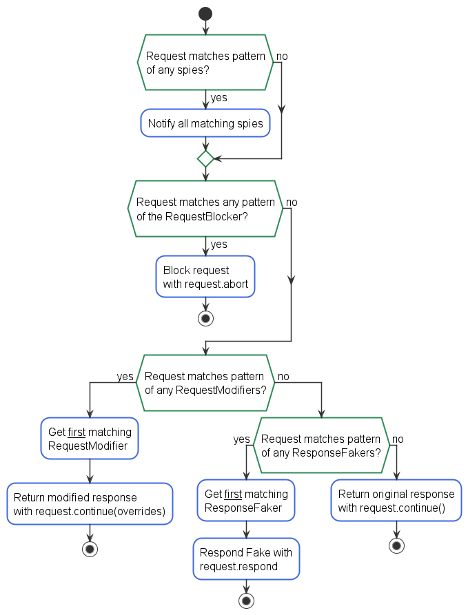

# puppeteer-request-spy
[](https://travis-ci.org/Tabueeee/puppeteer-request-spy)
[](https://coveralls.io/github/Tabueeee/puppeteer-request-spy?branch=master)
[](https://app.fossa.io/projects/git%2Bgithub.com%2FTabueeee%2Fpuppeteer-request-spy?ref=badge_shield)
> With puppeteer-request-spy you can easily watch, fake, modify or block requests from puppeteer matching patterns. 

- allows you to write tests verifying specific resources are loaded as expected
- allows you to exclude unneeded requests from tests, speeding them up significantly
- allows you to alter requests and responses with custom content and http status
- avoids conflicts resulting from already aborted / continued or responded requests

## Install

```bash
npm install puppeteer-request-spy --save-dev
```

## Table of Content

- [Spying on requests](#usage)
- [Altering requests](#altering-requests)
    - [Modifying requests](#modifying-requests)
    - [Redirecting requests](#redirecting-requests)
    - [Blocking requests](#blocking-requests)
- [Altering responses](#altering-responses)
    - [Faking responses](#faking-responses)
    - [Modifying responses](#modifying-responses)
- [Advanced usage](#advanced-usage)
- [Full API](./documentation/API.md)

## Usage

### Spying on requests with a KeywordMatcher 
First create a new `RequestInterceptor` with a `matcher` function and an optional logger. 
```js
function KeywordMatcher(testee, keyword) {
    return testee.indexOf(keyword) > -1; 
}

let requestInterceptor = new RequestInterceptor(KeywordMatcher, console);
```
Next create a new `RequestSpy` with a `pattern` to be matched against all requests.
```js
let imageSpy = new RequestSpy('/pictures');
```
The `RequestSpy` needs to be registered with the `RequestInterceptor`.
```js
requestInterceptor.addSpy(imageSpy);
```
To use the puppeteer's request event the RequestInterception flag on the page object has to be set to true. 
```js
await page.setRequestInterception(true);
```
The `RequestInterceptor` must be registered with puppeteer.
```js
page.on('request', requestInterceptor.intercept.bind(requestInterceptor));
```
After puppeteer's page object finished navigating to any page, you can query the `RequestSpy`.
 ```js
await page.goto('https://www.example.com');

assert.ok(!imageSpy.getMatchedRequests()[0].failure());
assert.ok(imageSpy.hasMatch() && imageSpy.getMatchCount() > 0);
``` 
When all responses have been loaded you can also query the response of any matched Request. You can ensure all responses have been loaded by using the networkidle0 option. For further information check the official [puppeteer API](https://github.com/GoogleChrome/puppeteer/blob/master/docs/api.md#pagegotourl-options). 
```js
for (let match of imagesSpy.getMatchedRequests()) {
    assert.ok(match.response().ok());
}
``` 
Note
> Since unhandled Promise rejections causes the node process to keep running after test failure, the `RequestInterceptor` will catch and log puppeteer's exception, if the `requestInterception` flag is not set.


### Altering Requests

All ResponseFakers and ResponseModifiers now accept a callback for resolving the passed options. This callback can also be async or return a promise. 

```js
// static mock
let requestRedirector = new RequestRedirector('/ajax/some-request', 'some/other/url');                  
// callback mock
let requestModifier = new RequestModifier('/ajax/some-request', (matchedRequest) => ({url: '/ajax/some-different-request'}));    
// async callback mock
let requestRedirector = new RequestRedirector('/ajax/some-request', async (matchedRequest) => 'some/new/url');                  
// promise callback mock
let responseFaker = new ResponseFaker('/ajax/some-request', (matchedRequest) => Promise.resolve(
    ({
        status: 200, 
        contentType: 'application/json',
        body: JSON.stringify({successful: false, payload: []})})
    )
);                                                        
```


#### Modifying Requests
Intercepted requests can be modified by passing an overrides object to the RequestModifier. The response overrides have to match the Overrides object as specified in the official [puppeteer API](https://github.com/puppeteer/puppeteer/blob/main/docs/api.md#httprequestcontinueoverrides).

```js
let requestModifier = new RequestModifier('/ajax/some-request', {
  url: '/ajax/some-different-request',
  method: 'GET',
  postData: '',
  headers: {}
});                  

requestInterceptor.addRequestModifier(requestModifier);
```

#### Redirecting Requests
If you just want to replace the url of an intercepted request, you can use the RequestRedirector.

```js
let requestRedirector = new RequestRedirector('/ajax/some-request', 'some/new/url');                  

requestInterceptor.addRequestModifier(requestRedirector);
```

The RequestRedirector uses the IRequestModifier interface.

#### Blocking Requests    
Optionally you can add `patterns` to block requests. Blocking requests speeds up page load since no data is loaded. Blocking requests takes precedence over faking responses, so any request blocked will not be replaced even when matching a `ResponseFaker`. Blocked or faked requests will still be counted by a `RequestSpy` with a matching pattern.  

```js
requestInterceptor.block(['scripts', 'track', '.png']);      
```

### Altering Responses

#### Faking Responses
The response of intercepted requests can be replaced by adding a ResponseFaker to the RequestInterceptor. The fake response has to match the Response object as specified in the official [puppeteer API](https://github.com/puppeteer/puppeteer/blob/main/docs/api.md#httprequestrespondresponse).
```js
let responseFaker = new ResponseFaker('/ajax/some-request', {
    status: 200,
    contentType: 'application/json',
    body: JSON.stringify({successful: false, payload: []})
});

requestInterceptor.addFaker(responseFaker);
```
For further details on how to replace different formats of data like images, text or html, please refer to the examples provided in the [github repository](https://github.com/Tabueeee/puppeteer-request-spy/blob/master/examples/fake-test.spec.js).

#### Modifying Responses
It's also possible to replace the content of a response instead of replacing it:

```js
let responseModifier = new ResponseModifier('/ajax/some-request', (response, request) => {
    return response.replace('</head>', '<script></script></head>');
});

requestInterceptor.addFaker(responseModifier);
```                   

Note:
> The request is currently loaded in the node environment, not the browser environment.

The ResponseModifier uses the IResponseFaker interface.

## RequestInterceptor request interception order:



## Advanced Usage

As long as you follow the interfaces provided in the [github repository](https://github.com/Tabueeee/puppeteer-request-spy/tree/master/src/interface) you can create your own Spies, Fakers or Modifiers.


````js 
const prs = require('..');

let interceptor = new prs.RequestInterceptor(
    (testee, pattern) => testee.indexOf(pattern) > -1
);

let count = 0;
interceptor.addSpy({
    isMatchingRequest: (_request, _matcher) => true,
    addMatch: (_request) => count++
});

interceptor.addFaker({
    isMatchingRequest: (_request, _matcher) => true,
    getResponseFake: (request) => ({body: ''})
});

interceptor.addRequestModifier({
    isMatchingRequest: (_request, _matcher) => true,
    getOverride: (interceptedRequest) => ({url: ''})
});

````

### Minimatch
puppeteer-request-spy works great with [minimatch](https://github.com/isaacs/minimatch), it can be passed as the `matcher` function.
```js
const minimatch = require('minimatch');

let cssSpy = new RequestSpy('**/*.css');
let responseFaker = new ResponseFaker('**/*.jpg', someFakeResponse);
                                                        
let requestInterceptor = new RequestInterceptor(minimatch);  
requestInterceptor.addFaker(responseFaker);
requestInterceptor.addSpy(cssSpy);   
requestInterceptor.block('**/*.js');

await page.setRequestInterception(true);
page.on('request', requestInterceptor.intercept.bind(requestInterceptor));  
await page.goto('https://www.example.com');
                                                 
assert.ok(cssSpy.hasMatch() && cssSpy.getMatchCount() > 0);
for (let matchedRequest of cssSpy.getMatchedRequests()) {
    assert.ok(matchedRequest.response().status() === 200);
}
```
# Examples

There are some usage examples included in the [github repository](https://github.com/Tabueeee/puppeteer-request-spy/tree/master/examples). Check them out to get started with writing a simple test with puppeteer and puppeteer-request-spy.

# Related
 - [minimatch](https://github.com/isaacs/minimatch) - For easily matching path-like strings to patterns.
 - [puppeteer](https://github.com/GoogleChrome/puppeteer) - Control chrome in headless mode with puppeteer for automated testing.

# License
MIT


[](https://app.fossa.io/projects/git%2Bgithub.com%2FTabueeee%2Fpuppeteer-request-spy?ref=badge_large)
